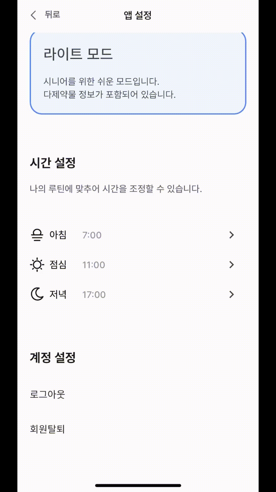

# 약 알(Yakal)

약 알(Yakal)은 환자의 복약을 도와 다약제 약물 섭취를 완화하고자하는 모바일, 웹 어플리케이션입니다. 

# 👋 팀원 소개

## Front-End([App](./frontend-hybrid/readme.md), [Web](./frontend-web/README.md))

| 이름                                      | 개발 파트                              |
| ----------------------------------------- | -------------------------------------- |
| [서희찬](https://github.com/seochan99)    | 모바일(Flutter)                     |
| [손형준](https://github.com/HyungJoonSon) | 모바일(Flutter), 인프라(NCP) |
| [김도훈](https://github.com/DoHunKim1215) | 웹(React), 모바일(Flutter)             |

## Back-end([WAS](./backend-server/README.md), [OCR](./ocr/README.md))

| 이름                                  | 개발 파트    |
| ------------------------------------- | ------------ |
| [나찬진](https://github.com/ckswls56) | 서버(Spring) |
| [강우빈](https://github.com/Shortood) | 서버(Spring) |

---

# 🛠️ Tech

## FrameWork

    
    

## Stack

    
    
    
     
    <!-- Front 추가 -->
    
     
    
    
    
    
     
    
    

---

## 1. 프로젝트 명

환자의 복약 관리 서비스, 약 알

## 2. 프로젝트 소개

> 우리나라 의사들의 평균 진료 시간은 5분 정도로 주어진 시간 안에 환자의 병을 치료하기 위해 추정 가능한 다양한 가능성의 약을 모두 처방한다. 우리나라는 OECD국가 중에서 과처방으로 인한 다약제 사용 부작용이 심각한 편이다. 젊은 나이에는 괜찮으나 약을 많이 먹는 환경이 지속되면 노화로 인해 약제의 부작용에 취약한 약물들이 많아져 다약제 사용시 다양한 합병증을 초래할 수 있다. 따라서 환자의 복약을 도와 다약제 사용을 완화하는 서비스를 개발하게 되었다.

---

## 3. 시연영상

## 회원가입화면/로그인화면

   

---

## 오늘/약 세부정보/다른 날짜 복약정보   

    

---
## 약 직접/OCR 추가
   

    
      

---

  ## 닉네임 수정

   ---

## 자가진단 테스트
   

       
    

   ---

## 병원 기록/특이사항

---

## 앱 설정
   

      
      
   

## 약알에게 바라는 점

## 🎯 Commit Convention

-   feat : 새로운 기능 추가
-   fix : 버그 수정
-   docs : 문서 수정
-   style : 코드 포맷팅, 세미콜론 누락, 코드 변경이 없는 경우
-   refactor: 코드 리펙토링
-   test: 테스트 코드, 리펙토링 테스트 코드 추가
-   chore : 빌드 업무 수정, 패키지 매니저 수정

## 💡 PR Convetion

| 아이콘 | 코드                       | 설명                     |
| ------ | -------------------------- | ------------------------ |
| 🎨     | :art                       | 코드의 구조/형태 개선    |
| ⚡️    | :zap                       | 성능 개선                |
| 🔥     | :fire                      | 코드/파일 삭제           |
| 🐛     | :bug                       | 버그 수정                |
| 🚑     | :ambulance                 | 긴급 수정                |
| ✨     | :sparkles                  | 새 기능                  |
| 💄     | :lipstick                  | UI/스타일 파일 추가/수정 |
| ⏪     | :rewind                    | 변경 내용 되돌리기       |
| 🔀     | :twisted_rightwards_arrows | 브랜치 합병              |
| 💡     | :bulb                      | 주석 추가/수정           |
| 🗃      | :card_file_box             | 데이버베이스 관련 수정   |

## How to Contribute

YAKAI에 기여 해주시고 싶은 분들은 <a href="https://github.com/View-Pharm/YakAl/wiki/Contribute-Guide#%ED%94%84%EB%A1%9C%EC%A0%9D%ED%8A%B8-%EA%B8%B0%EC%97%AC-%EA%B0%80%EC%9D%B4%EB%93%9C">WIKI</a>를 참고해주세요!

## Lisence
GNU GENERAL PUBLIC LICENSE
Version 3, 29 June 2007

Copyright (C) 2023 ViewPharm Company

This program is free software: you can redistribute it and/or modify
it under the terms of the GNU General Public License as published by
the Free Software Foundation, either version 3 of the License, or
(at your option) any later version.

This program is distributed in the hope that it will be useful,
but WITHOUT ANY WARRANTY; without even the implied warranty of
MERCHANTABILITY or FITNESS FOR A PARTICULAR PURPOSE.  See the
GNU General Public License for more details.

You should have received a copy of the GNU General Public License
along with this program.  If not, see <https://www.gnu.org/licenses/>.
